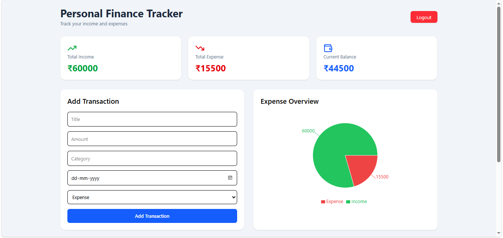

# Personal Finance Tracker

A full-stack web application to manage personal income and expenses.

## Features

* User Registration and Login
* JWT Authentication
* Income and Expense Tracking
* Dashboard Analytics
* Charts and Reports
* Transaction CRUD Operations

## Tech Stack

### Frontend

* React.js
* Axios
* React Router
* Recharts
* Tailwind CSS

### Backend

* Spring Boot
* Spring Security
* Spring Data JPA
* Maven

### Database

* PostgreSQL

## Project Structure

```text
backend/
frontend/
```

## Screenshots



## Future Enhancements

* Full JWT Authorization
* Budget Analytics
* PDF Reports
* CSV Export
* Docker Deployment
